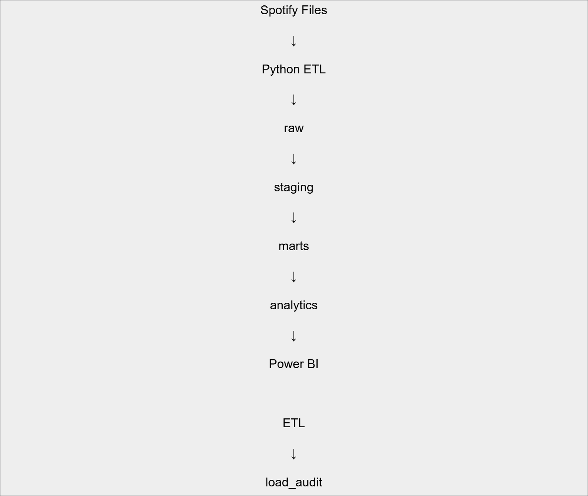
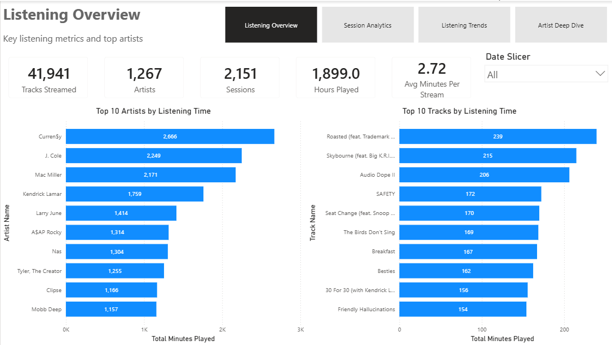
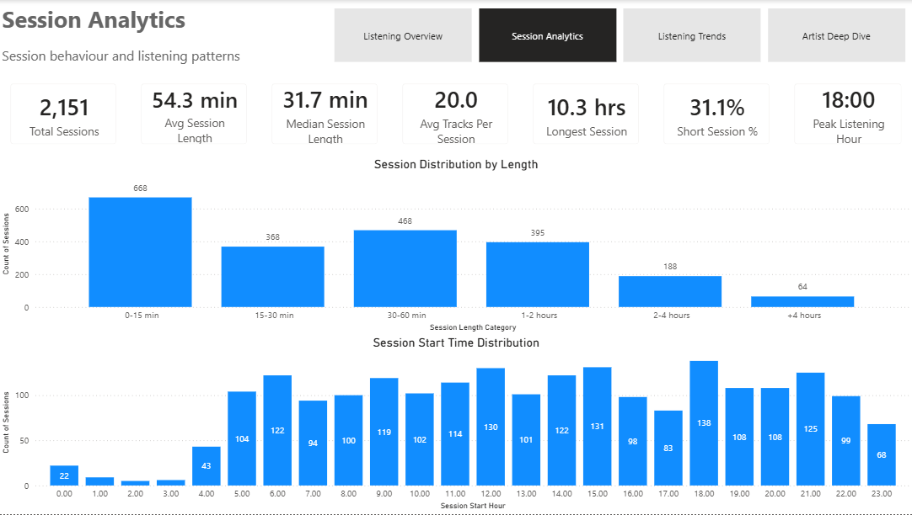
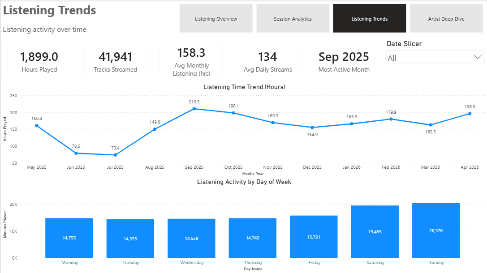
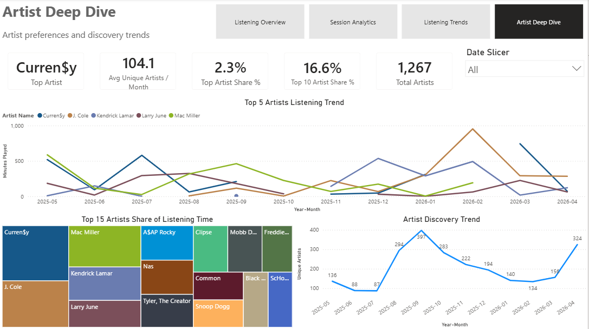
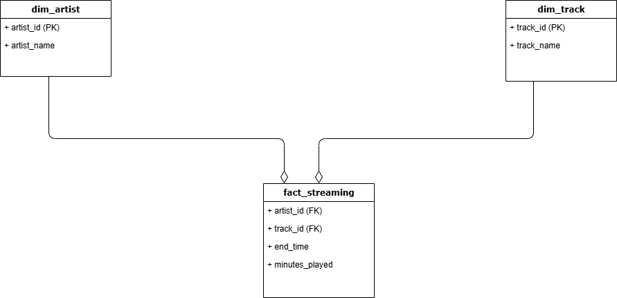

# Music Analytics Platform

## Overview

A Data Engineering and Analytics project built using Spotify streaming history data.

The platform ingests raw Spotify JSON files, loads them into PostgreSQL using a Python ETL pipeline, transforms the data into a star schema, and exposes analytical views for reporting and dashboarding.

## Tech Stack

* Python
* PostgreSQL (Neon)
* SQL
* DBeaver
* Git & GitHub
* Power BI

## Architecture

## Dashboard

The project includes an interactive Power BI dashboard built on top of the analytics layer.

### Pages

#### Listening Overview

Provides high-level listening metrics, including:

* Total tracks streamed
* Total artists
* Total listening time
* Top artists by listening time
* Top tracks by listening time

#### Session Analytics

Analyzes listening sessions created using SQL sessionization logic:

* Total sessions
* Average and median session length
* Session length distribution
* Peak listening hour
* Session start time analysis

#### Listening Trends

Tracks listening behavior over time:

* Monthly listening trend
* Most active month
* Average monthly listening time
* Listening activity by day of week

#### Artist Deep Dive

Explores artist preferences and discovery patterns:

* Top artist and listening share
* Top 10 artist concentration
* Artist listening trends
* Artist discovery trends
* Artist listening share treemap

## Dashboard Screenshots

### Listening Overview

### Session Analytics

### Listening Trends

### Artist Deep Dive

## Features

### Data Ingestion

* Multi-file processing
* Automatic file discovery
* Incremental loading
* Idempotent pipeline
* Hash-based event keys

### Data Modeling

* Raw layer
* Staging layer
* Star schema
* Fact and dimension tables

### Analytics

* Sessionization using SQL window functions
* Session metrics
* Listening behavior analysis

### Observability

* Audit logging
* Success/Failure tracking
* Error message capture
* Per-file processing statistics

### Power BI

* Multi-page dashboard
* Interactive date filtering
* KPI-driven reporting
* Navigation buttons
* Artist and session analytics

## Project Structure

music-analytics-platform/

├── docs/

├── etl/

├── sql/

│   ├── raw/

│   ├── staging/

│   ├── marts/

│   ├── analytics/

│   └── tests/

├── .gitignore

├── README.md

└── LICENSE

## Data Model

## Project Scale

* 43,049 Spotify streaming records
* 5 source JSON files
* 3 warehouse layers
* 1 fact table
* 2 dimension tables
* 7 data quality tests
* Incremental ingestion with audit logging

## Key Learnings

* ETL design
* Incremental data loading
* Data warehouse modeling
* SQL window functions
* Operational metadata
* Pipeline monitoring
* Git workflow
* Environment variable management